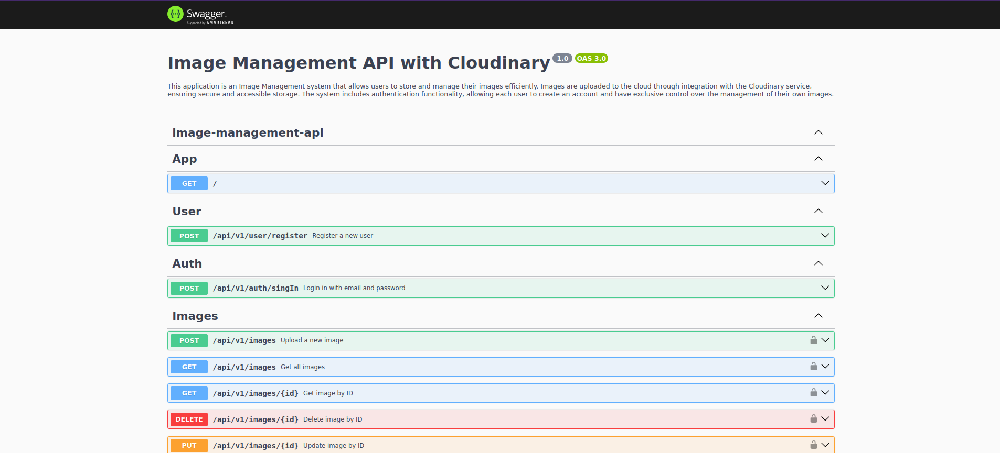

# API de Gerenciamento de Imagens com Cloudinary

Esta aplicação é um sistema de Gestão de Imagens que permite aos usuários armazenar e gerenciar suas imagens de forma eficiente. As imagens são carregadas para a nuvem por meio da integração com o serviço Cloudinary, garantindo armazenamento seguro e acessível. O sistema inclui uma funcionalidade de autenticação, permitindo que cada usuário crie uma conta e tenha controle exclusivo sobre o gerenciamento de suas próprias imagens.




## Arquitetura da Aplicação

A arquitetura da aplicação é composta por uma API REST desenvolvida com o framework NestJS e um banco de dados para a persistência dos dados.

## Tecnologias Utilizadas no Projeto

### Back-end:
- TypeScript
- NestJS
- Cloudinary
- TypeORM

### Banco de Dados:
- PostgreSQL

## Rodando o Projeto

### Dependências

- É necessário ter o Node.js instalado no seu computador. Para instalar, acesse: [Instalar Node.js](https://nodejs.org/en/download/package-manager).

- Para executar o projeto com Docker, é necessário ter o Docker e o Docker Compose instalados no seu computador. Para instalar, acesse: [Instalar Docker](https://docs.docker.com/engine/install/) e [Instalar Docker Compose](https://docs.docker.com/compose/install/).

- Também é necessário obter as credenciais de acesso ao **Cloudinary**. Para isso, você pode se cadastrar gratuitamente na plataforma [Cloudinary](https://cloudinary.com/).

### Executando o Projeto

1. Crie um arquivo chamado **.env** na raiz do projeto, copie as variáveis do arquivo **.env.example** e cole no arquivo **.env**. Adicione as credenciais do Cloudinary nas seguintes variáveis:

    ```
    CLOUDINARY_CLOUD_NAME = "cloudinary_cloud_name"
    CLOUDINARY_API_KEY = "cloudinary_api_key"
    CLOUDINARY_API_SECRET = "cloudinary_api_secret"
    ```

### Executando o Projeto com Docker

1. Abra um terminal na pasta raiz do projeto e execute o seguinte comando:

    ```bash
    docker compose up --build
    ```

### Executando o Projeto sem Docker

1. Para executar sem Docker, você deve ter o banco de dados PostgreSQL instalado e configurado em sua máquina. Insira as credenciais de acesso ao seu banco de dados nas seguintes variáveis no arquivo **.env**:

    ```
    DB_HOST = host
    DB_NAME = database_name
    DB_USER = root
    DB_PASSWORD = password
    DB_PORT = port
    ```

2. Abra um terminal na pasta raiz do projeto e execute o seguinte comando para instalar as dependências:

    ```bash
    npm install
    ```

3. Execute o seguinte comando para criar as tabelas no banco de dados:

    ```bash
    npm run migrate:run
    ```

4. Por fim, execute o comando para rodar a aplicação:

    ```bash
    npm run start
    ```

## Se tudo ocorrer bem , a API estará disponível:

- Rota principal da api

    ```
    http://localhost:3000/
    ```

- Para utilizar a API, você pode acessar a documentação disponível. Lá, você encontrará todas as rotas do sistema e suas respectivas instruções de execução, Acesse a documentação na seguinte rota:

    ```
        http://localhost:3000/api#/
    ```
